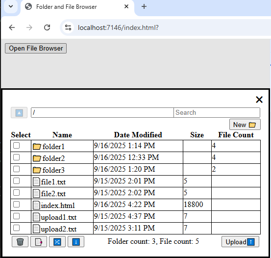

### File Browser

A lightweight, interactive web-based file browser that allows users to manage server-side files and folders directly from the browser. 
The interface supports standard file operations like browsing, uploading, renaming, deleting, copying, and moving files or folders. 
Users can also search for files using wildcard patterns, and the entire browser is contained within a dialog element for easy integration 
into larger applications. Double-clicking enables inline renaming of files and folders, and all actions are reflected in real time.

#### Features:
- Browse files and folders on the server
- Search for files using wildcards
- Upload files to the server
- Delete/Copy/Move files/folders from the server
- Create new folders on the server
- Moved browser into dialog element
- Rename files/folders using double-click 

#### Endpoints:
1. `/browse`: Endpoint for browsing files/folders on the server.
2. `/search`: Endpoint for searching files with wildcard characters.
3. `/upload`: Endpoint for uploading files to the server.
4. `/delete`: Endpoint for deleting files/folders from the server.
5. `/newFolder`: Endpoint for creating new folders on the server.
6. `/move`: Endpoint for moving files/folders on the server.
7. `/copy`: Endpoint for coping files/folders on the server.
8. `/rename`: Endpoint for renaming file/folders on the server.

#### Technologies Used:
- .NET framework for backend endpoints
- HTML, CSS, JavaScript for frontend interface
- Local file paths for file operations (wwwroot directory)